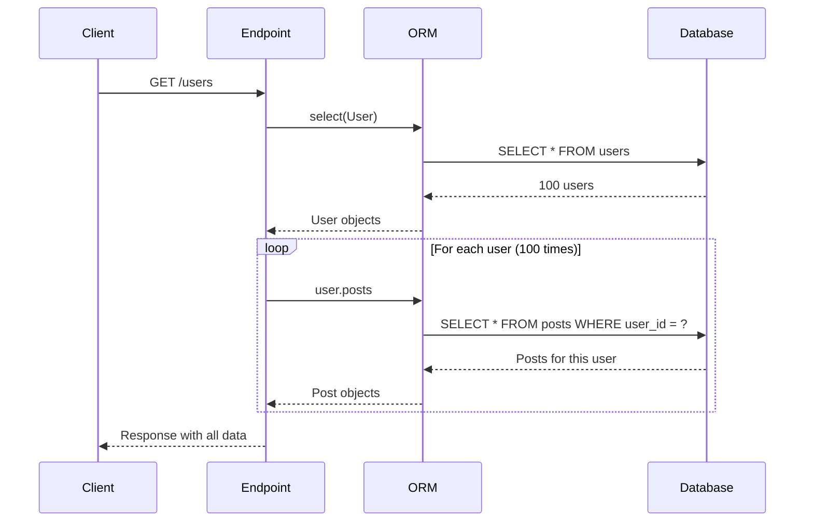

## Introduction

Imagine this, the devs ships a feature. Tests are passing wihtout a hitch. The reviewer approves it. And then the everything gets slow.

The logs show nothing unusual. No errors or exceptions. No timeouts. Just a database CPU that keeps climbing. And eventually, the cause surfaces: a single api load is generating hundreds of SQL queries.

The N+1 query problem is the most common ORM performance issue. It's also the hardest to catch before production. The code looks correct. The logic is sound. The bug only appears when you count the queries.

The real question is how to catch this before it ships. Fixes get merged, but the pattern resurfaces again, lost somewhere between schemas and serializers. That's what led me to SQLAlchemy's event system. It fires on every query. And it turns out, nothing extra is needed to see what's happening.

This is what I built from that: a lightweight observability layer that detects N+1 queries, prevents performance regressions in tests, monitors slow queries, and groups similar queries to find hot patterns.

No external dependencies. Just the ORM.

## The Hidden Cost of ORMs

ORMs make database code readable. Instead of SQL, one write:

```python
for user in users:
    print(user.posts)
```

That's clean. But it hides something.

When `user.posts` is accessed, SQLAlchemy fires a query to load that user's posts. Do this in a loop, and the cost compounds:

- **1 query** to load all users
- **N queries** to load posts for each user

Total: **N + 1 queries**. With 100 users, that's 101. With 10,000, that's 10,001.

The code doesn't look wrong. The logic is correct. But the database cost grows linearly with data size.

## Reproducing the Problem

A minimal example helps make it concrete. Two models:

```python
from sqlalchemy.orm import DeclarativeBase, relationship
from sqlalchemy import Column, Integer, String, ForeignKey

class Base(DeclarativeBase):
    pass

class User(Base):
    __tablename__ = "users"
    id = Column(Integer, primary_key=True)
    name = Column(String(100), nullable=False)
    posts = relationship("Post", back_populates="user", lazy="select")

class Post(Base):
    __tablename__ = "posts"
    id = Column(Integer, primary_key=True)
    title = Column(String(200), nullable=False)
    user_id = Column(Integer, ForeignKey("users.id"), nullable=False)
    user = relationship("User", back_populates="posts")
```

The key detail: `lazy="select"`. SQLAlchemy's default. It means "load posts only when accessed." That's convenient. It's also what causes N+1.

Here's the service function that triggers it:

```python
from sqlalchemy import select

def get_all_users_with_posts_n_plus_one(db):
    stmt = select(User)
    users = db.scalars(stmt).all()

    result = []
    for user in users:
        result.append({
            "id": user.id,
            "name": user.name,
            "posts": [{"id": p.id, "title": p.title} for p in user.posts],
        })
    return result
```

When `user.posts` is accessed inside the loop, SQLAlchemy fires a new query:

```sql
SELECT posts.id, posts.title, posts.user_id
FROM posts
WHERE posts.user_id = ?
```

This happens once per user. With 100 users and 5 posts each, that's 101 queries instead of 2.

The query flow:



The same query pattern repeats 100 times. Each one is fast individually. Together, they're a performance problem.

## Building a Query Counter

To see what's happening, SQLAlchemy's event system provides two hooks:

- `before_cursor_execute` - fires right before a query runs
- `after_cursor_execute` - fires right after a query completes

Attaching listeners to these events makes it possible to count queries, measure duration, and collect the SQL.

The implementation:

```python
import time
import threading
from contextlib import contextmanager
from dataclasses import dataclass, field
from sqlalchemy import event, Engine
from sqlalchemy.engine import Connection

@dataclass
class QueryRecord:
    sql: str
    params: Optional[dict]
    duration: float
    timestamp: float

@dataclass
class QueryCounter:
    engine: Engine
    queries: list[QueryRecord] = field(default_factory=list)
    _lock: threading.Lock = field(default_factory=threading.Lock, repr=False)
    _listener_registered: bool = field(default=False, repr=False)

    @property
    def query_count(self) -> int:
        return len(self.queries)

    @property
    def total_duration(self) -> float:
        return sum(q.duration for q in self.queries)

    def _on_before_execute(self, conn, cursor, statement, parameters, context, executemany):
        conn.info["_query_start_time"] = time.perf_counter()
        conn.info["_query_statement"] = statement
        conn.info["_query_parameters"] = parameters

    def _on_after_execute(self, conn, cursor, statement, parameters, context, executemany):
        start_time = conn.info.pop("_query_start_time", None)
        if start_time is not None:
            duration = time.perf_counter() - start_time
            record = QueryRecord(
                sql=statement,
                params=parameters,
                duration=duration,
                timestamp=time.time(),
            )
            with self._lock:
                self.queries.append(record)

    def __enter__(self):
        event.listen(self.engine, "before_cursor_execute", self._on_before_execute)
        event.listen(self.engine, "after_cursor_execute", self._on_after_execute)
        self._listener_registered = True
        return self

    def __exit__(self, exc_type, exc_val, exc_tb):
        if self._listener_registered:
            event.remove(self.engine, "before_cursor_execute", self._on_before_execute)
            event.remove(self.engine, "after_cursor_execute", self._on_after_execute)
            self._listener_registered = False
        return False
```

### How It Works

`__enter__` registers event listeners on the engine. Every query through that engine triggers the callbacks.

`_on_before_execute` stores the start time and SQL in `conn.info` -- a per-connection dictionary that persists across the event pair.

`_on_after_execute` calculates the duration and appends a `QueryRecord`.

`__exit__` removes the listeners. This matters -- without cleanup, the listeners persist and affect other code.

The context manager pattern keeps the API clean:

```python
with QueryCounter(engine) as qc:
    result = get_all_users_with_posts_n_plus_one(db)

print(f"Executed {qc.query_count} queries")
```

### How SQLAlchemy Events Work Internally

`event.listen(engine, "before_cursor_execute", callback)` adds the callback to an internal list. Every time the engine executes a cursor, it iterates through that list.

The `conn.info` dictionary is per-connection storage. It's how the start time passes from `_on_before_execute` to `_on_after_execute` without global state.

For more details, see the [SQLAlchemy event documentation](https://docs.sqlalchemy.org/en/20/core/events.html).

## Detecting N+1 in Tests

With a way to count queries, the next step was putting it in tests.

```python
from app.observability import QueryCounter

def test_n_plus_one_triggers_many_queries(seeded_engine):
    """The naive implementation should trigger 101+ queries."""
    Session = sessionmaker(bind=seeded_engine)
    with QueryCounter(seeded_engine) as qc:
        db = Session()
        result = get_all_users_with_posts_n_plus_one(db)
        db.close()

    assert len(result) == 100
    assert qc.query_count >= 101
```

This test passes when the N+1 bug is present. It documents the problem and quantifies its cost.

The regression guard is where it becomes useful:

```python
def test_selectinload_regression_guard(seeded_engine):
    """Regression test: selectinload must not exceed 2 queries."""
    Session = sessionmaker(bind=seeded_engine)
    with QueryCounter(seeded_engine) as qc:
        db = Session()
        result = get_all_users_with_posts_selectinload(db)
        db.close()

    assert qc.query_count <= 2, (
        f"Query count regression: expected <= 2, got {qc.query_count}"
    )
```

This fails if a new query gets introduced. It's a performance contract enforced by the test suite.

### Why This Belongs in CI

Performance regressions are silent. They don't break functionality. They don't raise exceptions. They just make things slower, one query at a time.

Query count assertions in tests provide:

- **Automatic detection** of new queries introduced by code changes
- **Quantified baselines** so "normal" has a number attached to it
- **Fail-fast behavior** for the CI pipeline  to reject the PR before it merges

## Fixing It

SQLAlchemy provides two eager loading strategies.

### selectinload()

```python
from sqlalchemy.orm import selectinload

def get_all_users_with_posts_selectinload(db):
    stmt = select(User).options(selectinload(User.posts))
    users = db.scalars(stmt).all()
    ...
```

This generates **2 queries**:

```sql
SELECT users.id, users.name FROM users;
SELECT posts.id, posts.title, posts.user_id FROM posts WHERE posts.user_id IN (?, ?, ?, ...);
```

The second query uses an `IN` clause with all user IDs. The database can use an index on `user_id`.

### joinedload()

```python
from sqlalchemy.orm import joinedload

def get_all_users_with_posts_joinedload(db):
    stmt = select(User).options(joinedload(User.posts))
    users = db.scalars(stmt).unique().all()
    ...
```

This generates **1 query**:

```sql
SELECT users.id, users.name, posts.id AS id_1, posts.title, posts.user_id
FROM users
LEFT OUTER JOIN posts ON users.id = posts.user_id;
```

The `.unique()` call matters -- without it, SQLAlchemy returns duplicate User objects, one per joined post row.

### Tradeoffs

| Strategy | Query Count | Best For | Caveat |
|---|---|---|---|
| Lazy loading | N + 1 | Small datasets | Performance disaster at scale |
| `selectinload()` | 2 | Medium datasets, large collections | Two round trips to DB |
| `joinedload()` | 1 | Small collections, single related object | Result set can be large with many rows |

`selectinload()` works well for collections (one-to-many). `joinedload()` works better for single related objects (many-to-one).

For more details, see the [SQLAlchemy eager loading documentation](https://docs.sqlalchemy.org/en/20/orm/loading_relationships.html).


## Before and After

The comparison from the demo (10 users, 3 posts each):

| Strategy | Query Count | Reduction |
|---|---|---|
| Lazy Loading (N+1) | 11 | baseline |
| `selectinload()` | 2 | 82% fewer queries |
| `joinedload()` | 1 | 91% fewer queries |

With 100 users and 5 posts each:

| Strategy | Query Count | Reduction |
|---|---|---|
| Lazy Loading (N+1) | 101 | baseline |
| `selectinload()` | 2 | 98% fewer queries |
| `joinedload()` | 1 | 99% fewer queries |

The improvement scales with data size.

## SQLAlchemy Events Are More Powerful Than You Think

The `QueryCounter` is just the start. The same event mechanism can also:

- Track query duration to find slow queries
- Normalize SQL to group similar queries
- Collect per-request metrics for endpoint analysis
- Detect duplicate query patterns

## Building a Lightweight Database Observability Layer

### Slow Query Monitoring

Sometimes the problem isn't how many queries, but how long they take. A single slow query can be worse than 100 fast ones.

```python
@dataclass
class SlowQueryTracker:
    engine: Engine
    threshold: float = 0.1  # 100ms
    slow_queries: list[SlowQueryRecord] = field(default_factory=list)

    def _on_after_execute(self, conn, cursor, statement, parameters, context, executemany):
        start = conn.info.pop("_slow_query_start", None)
        if start is not None:
            duration = time.perf_counter() - start
            if duration >= self.threshold:
                self.slow_queries.append(SlowQueryRecord(
                    sql=statement,
                    duration=duration,
                    threshold=self.threshold,
                    timestamp=time.time(),
                ))
```

Usage:

```python
with SlowQueryTracker(engine, threshold=0.25) as tracker:
    run_expensive_report()

if tracker.slow_count > 0:
    print(f"Warning: {tracker.slow_count} queries exceeded 250ms")
```

### Query Fingerprinting

Some query patterns appear constantly. Normalizing SQL by replacing literal values with placeholders makes them visible:

```python
import re

def fingerprint_sql(sql: str) -> str:
    normalized = sql.strip()
    normalized = re.sub(r"'[^']*'", "?", normalized)
    normalized = re.sub(r"\b\d+\b", "?", normalized)
    normalized = " ".join(normalized.split())
    return normalized
```

This turns:

```sql
SELECT * FROM users WHERE id = 1
SELECT * FROM users WHERE id = 42
SELECT * FROM users WHERE id = 99
```

Into a single fingerprint:

```sql
SELECT * FROM users WHERE id = ?
```

The `FingerprintCollector` groups queries by their normalized pattern:

```python
with FingerprintCollector(engine) as collector:
    run_application_workload()

for fp in collector.get_hottest_query(n=5):
    print(f"Executed {fp.count}x ({fp.total_duration:.4f}s total)")
    print(f"  {fp.pattern}")
```

Sample output:

```txt
Query Fingerprint Report
============================================================
Total unique patterns: 3

  [1] Executed 100x (0.0234s total)
      SELECT posts.id, posts.title, posts.user_id FROM posts WHERE posts.user_id = ?

  [2] Executed 1x (0.0012s total)
      SELECT users.id, users.name FROM users

  [3] Executed 1x (0.0008s total)
      SELECT 1
```

The hottest pattern stands out immediately: the N+1 query, executed 100 times.

### Request-Level Metrics

Combining these tools makes per-request dashboards possible:

```python
from app.observability import QueryCounter

@app.middleware("http")
async def track_db_metrics(request, call_next):
    with QueryCounter(engine) as qc:
        response = await call_next(request)

    response.headers["X-Query-Count"] = str(qc.query_count)
    response.headers["X-DB-Time"] = f"{qc.total_duration:.4f}"
    return response
```

Every response carries its database cost. The metrics can be logged, sent to a monitoring system, or used in load testing.

### Endpoint Cost Visibility

With query counting in place, cost reports emerge naturally:

```txt
Endpoint                    Queries    DB Time (ms)
GET /users/n-plus-one       101        23.4
GET /users/selectinload     2          1.2
GET /users/joinedload       1          0.8
GET /health                 0          0.0
```

The expensive endpoint is obvious. No profiling tool needed.

---

## CI/CD Integration

This is how query count regression testing fits into a pipeline.

### 1. Add Query Assertions to Tests

```python
def test_endpoint_query_count(client):
    with QueryCounter(test_engine) as qc:
        response = client.get("/users/selectinload")
    assert response.status_code == 200
    assert qc.query_count <= 2
```

### 2. Set Baselines for Each Endpoint

```python
EXPECTED_QUERY_COUNTS = {
    "/users/selectinload": 2,
    "/users/joinedload": 1,
    "/posts/list": 3,
}
```

### 3. Run Regression Tests in CI

```yaml
# .github/workflows/test.yml
- name: Run tests
  run: pytest tests/ -v --cov=app
```

If a PR increases query counts beyond the baseline, the test fails. Feedback is immediate.

### 4. Monitor in Staging

Deploy with query counting enabled in staging. Collect metrics over a few days. Compare against production baselines.

## Lessons Learned

1. **N+1 bugs are invisible in code review.** The code looks correct. The logic is sound. The only way to catch them is to count queries.

2. **SQLAlchemy events are underutilized.** Most developers know about `before_cursor_execute` but don't realize how useful it is for observability. An APM tool isn't required to see what the ORM is doing.

3. **Tests are the best place for regression guards.** A failing test is harder to ignore than a slow dashboard. Query count assertions belong in the test suite.

4. **Eager loading is not always the answer.** `joinedload()` can produce massive result sets. `selectinload()` adds a round trip. The choice depends on data shape.

5. **Start simple.** OpenTelemetry, distributed tracing, and metrics platforms all have their place. But a 50-line context manager catches N+1 just fine.

## Resources

- [SQLAlchemy Event System](https://docs.sqlalchemy.org/en/20/core/events.html)
- [Eager Loading Relationships](https://docs.sqlalchemy.org/en/20/orm/loading_relationships.html)
- [selectinload() Documentation](https://docs.sqlalchemy.org/en/20/orm/loading_relationships.html#sqlalchemy.orm.selectinload)
- [joinedload() Documentation](https://docs.sqlalchemy.org/en/20/orm/loading_relationships.html#sqlalchemy.orm.joinedload)
- [Full Project Source Code](https://github.com/yourusername/n-plus-one-unit-poc)
